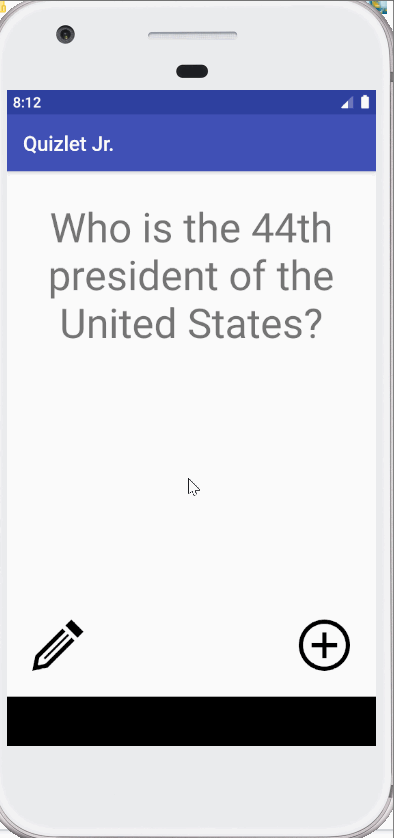

## Quizlet Jr.

## Lab 3

### App Description
`TODO://` Add app description

### App Walk-though
`TODO://` Add the URL to your animated app walk-though `gif` in the image tag below. Make sure the gif actually renders and animates when viewing this README. (☝️ Remove this paragraph after after adding gif)

 

`TODO://` In the User stories section below, add an `x` between the `-[ ]` like this `- [x]` for any user story you complete. (☝️ Remove this paragraph after after checking off user stories)

## Required
- [ ] User can create a card and still see their created card when the app is relaunched.
- [ ] User can create muliple cards and browse through all created cards

## Optional
- [ ] User can delete a card and no longer see it in their deck anymore
- [ ] Flashcards are shown in random order instead of the order they were created in
- [ ] User can edit a card and see the edit saved when they browse through their deck of cards
- [ ] User can create flashcards with multiple answers and be able to browse through cards with multiple choice answers shown

## Lab 2

### App Description
Simple flashcard app that displays one question. Tapping the question will replace it with the answer. Includes a mode to add a new flashcard, and a mode to edit the current flashcard.

### App Walk-though

 

## Required
- [x] User can click on a ‘+’ button that takes the user to new ‘Add Card Screen’
- [x] The 'Add Card Screen' has a cancel button to take the user back to the main screen
- [x] User can enter and submit a Question and Answer through the 'Add Card Screen'
- [x] User will see the card they just created on the main screen when they press the 'Save Button'
- [x] Push your progress to GitHub!

## Optional
- [x] User can edit a card
- [x] An error message is shown if the user doesn't enter both a Question and an Answer
- [ ] A notification is shown if the card was created successfully
- [ ] User can also enter multiple choice answers when creating a card
- [ ] App is further styled and customized!

## Lab 1

### App Description
Simple flashcard implementation, with one question. Tapping the question will replace it with the answer. 

### App Walk-though

 

## Required
- [x] Create New Project in Android Studio
- [x] Add a view for the front side of the flashcard to display the question
- [x] Add a view for the back side of the flashcard to display the answer
- [x] Build in logic to show the answer side when the card is tapped
- [x] Push code to GitHub
## Optional
- [ ] toggle the flashcard between the question side and the answer side
- [ ] Style the question and answer side of the card to better distinguish between the two sides
- [ ] Add selectable multiple choice answers beneath the card
   - [ ] Change the background color of the multiple choice answers when clicked to indicate whether the question waanswered correctly
- [ ] Further customize and style the card
